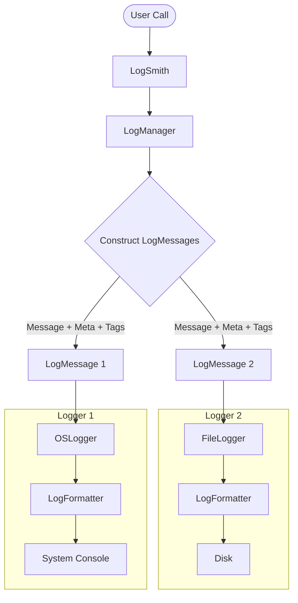

# SwiftLogSmith

A lightweight, flexible, and thread-safe logging library for Swift, designed to make logging effortless yet powerful. Built with support for **Swift 6 Concurrency**.

[](https://swift.org)
[](https://developer.apple.com)
[](https://github.com/eeshanjamal/swift-logsmith)
[](LICENSE)

## Overview

**SwiftLogSmith** is built to get you logging immediately with zero configuration while offering deep customization for advanced needs. Whether you need simple console output or complex file logging with rotation and archiving, SwiftLogSmith handles it with a clean, modern API that is safe for modern concurrent Swift environments.

## Key Features

- **🚀 Zero Config:** Start logging instantly with `LogSmith.log()`. No setup required.
- **🖥️ System Logging:** Seamless integration with Apple's unified logging system (`os.Logger`) via `OSLogger`.
- **📂 File Logging:** Robust file logging with `FileLogger`, featuring automatic rolling, archiving, and purging based on variety of `RollingFrequency` implementations.
- **🏷️ Contextual Tags:** Add global or per-logger tags (e.g., `[User: 123]`, `[Env: Dev]`) to track context across your logs.
- **🎨 Custom Formatting:** Design your own log format using the powerful `LogFormatter` builder pattern.
- **🔒 Thread Safe:** All operations are thread-safe, following modern Swift 6 concurrency principles.
- **🔌 Obj-C Support:** Designed to be easily used in Swift and Objective-C interoperable projects.

## Installation

Add `SwiftLogSmith` to your project via Swift Package Manager.

### Package.swift

```swift
dependencies: [
    .package(url: "https://github.com/eeshanjamal/swift-logsmith.git", from: "1.0.0")
]
```

## Quick Start

Import the library and start logging. By default, logs are directed to the system console.

```swift
import SwiftLogSmith

// 1. Simple Log
LogSmith.log("Application launched 🚀")

// 2. Error Log with Metadata
LogSmith.logE("Network request failed", metadata: ["error_code": "404"])

// 3. Debug Log
LogSmith.logD("User tapped button")
```

## Advanced Usage

### 1. Adding Context with Tags

Tags allow you to attach persistent context to your logs, making filtering and debugging easier.

```swift
// Add a static tag
LogSmith.addTag(ExternalTag(identifier: "Env", value: "Staging"))

// Add a dynamic tag (evaluated at runtime)
LogSmith.addTag(ExternalTag(identifier: "Date", valueProvider: { Date().description }))

// Output: [Env: Staging] [2026-02-24 10:30:00 +0000] [I] User logged in
LogSmith.logI("User logged in")
```

### 2. File Logging

Configure `FileLogger` to write logs to disk with automatic file management.

```swift
do {
    // Configure file management: Roll logs every 1 hour, keep max 10 archives
    let manager = try FileLoggerManager(
        rollingFrequency: TimeRollingFrequency(rollingInterval: 3600),
        maximumArchiveFiles: 10
    )
    
    // Create the logger
    let fileLogger = FileLogger(fileLoggerManager: manager)
    
    // Add to LogSmith
    LogSmith.addLogger(newLogger: fileLogger)
} catch {
    print("Failed to initialize FileLogger: \(error)")
}
```

### 3. Custom Formatting

Take full control over how your log messages look by replacing the default logger with a customized one.

```swift
// 1. Build a custom formatter
let customFormatter = LogFormatter.Builder()
    .addTagsPart(prefix: "[", suffix: "] ", filter: { $0.identifier == "Env" }) // Show environment tag value with custom prefix & postfix
    .addMessagePart(prefix: "📢 ") // Add an emoji before every message
    .build()

// 2. Replace the default OSLogger with one using your custom formatter
let myLogger = OSLogger(logFormatter: customFormatter)
LogSmith.replaceDefaultLogger(with: myLogger)

// 3. Log a message
LogSmith.addTag(ExternalTag(identifier: "Env", value: "Production"))
LogSmith.log("Network status is stable")

// Expected Output:
// [Production] 📢 Network status is stable
```

## Architecture

SwiftLogSmith follows a modular design to separate data gathering, formatting, and output.



## Documentation

Full API documentation is available here:  
[**Read the Documentation**](https://eeshanjamal.github.io/swift-logsmith/documentation/swiftlogsmith/)

## License

This project is licensed under the MIT License. See the [LICENSE](LICENSE) file for details.
