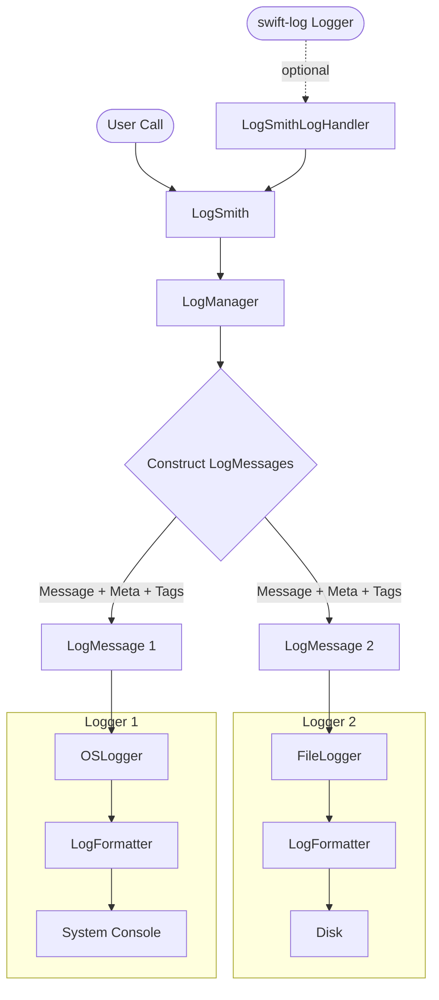

# SwiftLogSmith

A lightweight, flexible, and thread-safe logging library for Swift, designed to make logging effortless yet powerful. Built with support for **Swift 6 Concurrency**.

[](https://github.com/eeshanjamal/swift-logsmith/actions/workflows/build-and-test.yml)
[](https://swiftpackageindex.com/eeshanjamal/swift-logsmith)
[](https://swiftpackageindex.com/eeshanjamal/swift-logsmith)
[](https://github.com/eeshanjamal/swift-logsmith)
[](LICENSE)

## Overview

**SwiftLogSmith** is built to get you logging immediately with zero configuration while offering deep customization for advanced needs. Whether you need simple console output or complex file logging with rotation and archiving, SwiftLogSmith handles it with a clean, modern API that is safe for modern concurrent Swift environments.

## Key Features

- **🚀 Zero Config:** Start logging instantly with `LogSmith.log()`. No setup required.
- **🖥️ System Logging:** Seamless integration with Apple's unified logging system (`os.Logger`) via `OSLogger`.
- **📂 File Logging:** Robust file logging with `FileLogger`, featuring automatic rolling, archiving, and purging based on variety of `RollingFrequency` implementations.
- **🏷️ Contextual Tags:** Add global or per-logger tags (e.g., `[User: 123]`, `[Env: Dev]`) to track context across your logs.
- **🎨 Custom Formatting:** Design your own log format using the powerful `LogFormatter` builder pattern.
- **🔒 Thread Safe:** All operations are thread-safe, following modern Swift 6 concurrency principles.
- **🔌 Obj-C Support:** Designed to be easily used in Swift and Objective-C interoperable projects.
- **🌉 swift-log Backend:** Opt into `SwiftLogSmithBackend` to capture logs from any package using [apple/swift-log](https://github.com/apple/swift-log), including your third-party dependencies.

## Installation

### Xcode Project

1. Open your project in Xcode.
2. Go to **File** > **Add Package Dependencies...**.
3. Enter the repository URL: `https://github.com/eeshanjamal/swift-logsmith.git`
4. Select the version or branch you want to use.
5. Click **Add Package**.

### Swift Package

Add `SwiftLogSmith` to your `Package.swift` file:

```swift
dependencies: [
    .package(url: "https://github.com/eeshanjamal/swift-logsmith.git", from: "1.0.0")
]
```

Then add the product to your target:

```swift
.target(
    name: "MyApp",
    dependencies: [
        .product(name: "SwiftLogSmith", package: "swift-logsmith")
    ])
```

The package also vends an optional `SwiftLogSmithBackend` product, which makes SwiftLogSmith a backend for
[apple/swift-log](https://github.com/apple/swift-log). Add it alongside `SwiftLogSmith` only if you need it —
the core library has no `swift-log` dependency.

```swift
.product(name: "SwiftLogSmithBackend", package: "swift-logsmith")
```

> **Note:** `SwiftLogSmithBackend` requires **Swift 6.2+**, because `swift-log` 1.11.0 and later declare
> `swift-tools-version:6.2`. The core `SwiftLogSmith` library continues to support Swift 6.0.

## Quick Start

Import the library and start logging. By default, logs are directed to the system console.

```swift
import SwiftLogSmith

// 1. Simple Log
LogSmith.log("Application launched 🚀")

// 2. Error Log with Metadata
LogSmith.logE("Network request failed", metadata: ["error_code": "404"])

// 3. Debug Log
LogSmith.logD("User tapped button")
```

## Advanced Usage

### 1. Adding Context with Tags

Tags allow you to attach persistent context to your logs, making filtering and debugging easier.

```swift
// Add a static tag
LogSmith.addTag(ExternalTag(identifier: "Env", value: "Staging"))

// Add a dynamic tag (evaluated at runtime)
LogSmith.addTag(ExternalTag(identifier: "Date", valueProvider: { Date().description }))

// Output: [Env: Staging] [2026-02-24 10:30:00 +0000] [I] User logged in
LogSmith.logI("User logged in")
```

### 2. File Logging

Configure `FileLogger` to write logs to disk with automatic file management.

```swift
do {
    // Configure file management: Roll logs every 1 hour, keep max 10 archives
    let manager = try FileLoggerManager(
        rollingFrequency: TimeRollingFrequency(rollingInterval: 3600),
        maximumArchiveFiles: 10
    )
    
    // Create the logger
    let fileLogger = FileLogger(fileLoggerManager: manager)
    
    // Add to LogSmith
    LogSmith.addLogger(newLogger: fileLogger)
} catch {
    print("Failed to initialize FileLogger: \(error)")
}
```

### 3. Custom Formatting

Take full control over how your log messages look by replacing the default logger with a customized one.

```swift
// 1. Build a custom formatter
let customFormatter = LogFormatter.Builder()
    .addTagsPart(prefix: "[", suffix: "] ", filter: { $0.identifier == "Env" }) // Show environment tag value with custom prefix & postfix
    .addMessagePart(prefix: "📢 ") // Add an emoji before every message
    .build()

// 2. Replace the default OSLogger with one using your custom formatter
let myLogger = OSLogger(logFormatter: customFormatter)
LogSmith.replaceDefaultLogger(with: myLogger)

// 3. Log a message
LogSmith.addTag(ExternalTag(identifier: "Env", value: "Production"))
LogSmith.log("Network status is stable")

// Expected Output:
// [Production] 📢 Network status is stable
```

### 4. Using SwiftLogSmith as a swift-log Backend

Add the `SwiftLogSmithBackend` product and bootstrap once at launch. Every `Logger(label:)` in the process —
**including loggers inside the packages you depend on** — is then delivered to your registered loggers,
honouring the same filters, tags and formatters as first-party `LogSmith` calls.

```swift
import Logging
import SwiftLogSmith
import SwiftLogSmithBackend

// 1. Bootstrap once, as early as possible
LoggingSystem.bootstrapWithLogSmith()

// 2. Configure SwiftLogSmith as usual
LogSmith.addLogger(newLogger: FileLogger())

// 3. Any swift-log logger now flows into SwiftLogSmith
let logger = Logger(label: "com.demo.net")
logger.error("Request failed", metadata: ["user": ["id": "7"], "code": "404"])

// Expected Output (via OSLogger and FileLogger):
// [E] Request failed ["label": "com.demo.net", "source": "MyApp", "code": "404", "user": "[\"id\": \"7\"]"]
```

`swift-log` metadata is a tree, while `LogMessage.metadata` is a flat `[String: String]`. Both are populated:
a readable rendering lands in `metadata` so the default formatter shows it immediately, and the untouched
original travels in a `SwiftLogPayload`:

```swift
final class MyLogger: ILogger {
    func log(message: LogMessage, completion: (@Sendable (Bool) -> Void)?) {
        if let payload = message.payload as? SwiftLogPayload {
            print(payload.label)                       // "com.demo.net"
            print(payload.resolvedMetadata ?? [:])     // nested structure preserved
        }
        completion?(true)
    }
    // ...
}
```

To keep `swift-log` traffic on a separate pipeline, bootstrap against your own `LogManager` instead:

```swift
let manager = LogManager(identifier: "swift-log", defaultLogger: OSLogger())
LoggingSystem.bootstrapWithLogSmith(manager: manager)
```

> **Filtering:** `swift-log` performs its own level check before calling the backend, so the effective
> threshold is the stricter of the two systems. Prefer filtering with `logger.logLevel` or
> `bootstrapWithLogSmith(defaultLogLevel:)` and leave `LogSmith.setMinimumLogType(_:)` at its default —
> `LogType` orders `notice` < `info` < `debug` < `trace`, which is the reverse of `swift-log`'s ordering,
> so `setMinimumLogType(.info)` would discard `swift-log` `.notice` messages.

## Architecture

SwiftLogSmith follows a modular design to separate data gathering, formatting, and output.


```mermaid
graph TD
    User([User Call]) --> LogSmith[LogSmith]
    SwiftLog([swift-log Logger]) -.optional.-> Handler[LogSmithLogHandler]
    Handler --> LogSmith
    LogSmith --> LogManager[LogManager]

    LogManager --> Construct{Construct LogMessages}
    
    Construct -->|Message + Meta + Tags| Message1[LogMessage 1]
    Construct -->|Message + Meta + Tags| Message2[LogMessage 2]

    Message1 --> Dest1[OSLogger]
    Message2 --> Dest2[FileLogger]

    subgraph "Logger 2"
        Dest2 --> Formatter2[LogFormatter]
        Formatter2 --> Output2[Disk]
    end

    subgraph "Logger 1"
        Dest1 --> Formatter1[LogFormatter]
        Formatter1 --> Output1[System Console]
    end
    
```

## Documentation

Full API documentation is available here:  
[**Read the Documentation**](https://eeshanjamal.github.io/swift-logsmith/documentation/swiftlogsmith/)

## License

This project is licensed under the MIT License. See the [LICENSE](LICENSE) file for details.
